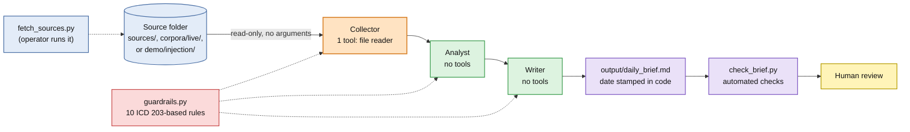

# Space-Cyber Brief Crew

Space-segment cyber reporting is scattered across advisories, notices, and forums, and triaging it by hand is slow. Space-Cyber Brief Crew is a governed multi-agent pipeline, built with CrewAI, that turns a folder of those documents into a structured daily intelligence brief, and then **measures** whether the agents followed their analytic rules instead of assuming they did.

It is built for threat intelligence analysts, SOC teams, and researchers working on space, ground, and link segment security. It runs on a hosted model or fully offline on a local one.

It accompanies the paper *Governing the Intelligence Loop: Architectural Mitigations for Epistemic Fragility in Autonomous Space-Cyber Threat Analysis* (Taki and Rodiles Delgado).

## What it does

- **Writes the brief.** Three agents collect, analyze, and write: severity, confidence, MITRE ATT&CK or ATLAS mappings, and What Happened / Why It Matters / What to Watch for each item.
- **Contains injected instructions.** Only the Collector has a tool, and it can only read one operator-chosen folder. The agents that interpret the content have no tools at all.
- **Checks its own output.** `check_brief.py` flags invented CVE IDs, citations of files that don't exist, missing classification markings, and canary strings planted by prompt-injection tests.
- **Runs on real reporting.** `fetch_sources.py` pulls current CISA advisories into a corpus with provenance recorded for every document.

## Sample output

An excerpt from a brief generated on September 28, 2026 from live CISA advisories. Full brief: [`demo/fallback_brief.md`](demo/fallback_brief.md).

<details>
<summary>Show the excerpt</summary>

**Date:** September 28, 2026<br>
**Classification:** UNCLASSIFIED // FOR EDUCATIONAL USE

---

### Executive Summary

September 28's briefing highlights critical vulnerabilities across multiple critical infrastructure sectors including Industrial Control Systems, Satellite Communications, Physical Security, Electrical Power, and Transportation. The Mitsubishi Electric MELSEC controllers and Siemens Reyrolle 7SR5 relay devices present critical denial-of-service and unauthorized access risks that could severely impact industrial processes and power grid stability. Satellite communication terminals and surveillance devices face high-risk multi-vector intrusions capable of unauthorized control and data manipulation. Transportation sector vulnerabilities in dashcams and fleet management systems pose risks of credential compromise and device manipulation. Immediate patching, network segmentation, and rigorous monitoring remain essential defenses.

### 1. Mitsubishi Electric CC-Link IE TSN Communication Protocol

**What Happened:** A critical vulnerability affects Mitsubishi MELSEC industrial controllers and communication modules. Attackers with network access can send crafted packets that disrupt device operations, causing denial-of-service conditions affecting industrial process control.

**Why It Matters:** This weakness threatens critical infrastructure control systems, potentially halting industrial operations and causing cascading operational failures. Given its critical severity and high confidence, swift action is mandatory.

**What to Watch:**
- Restrict network access to CC-Link IE TSN networks to trusted entities only.
- Apply vendor-recommended patches as soon as available.

**Severity:** Critical<br>
**Confidence:** High<br>
(Source: icsa-26-211-07.md)

</details>

## How it works



Colors show trust level. Blue: operator-controlled inputs. Orange: the only agent with a tool. Green: agents with no tools. Red: guardrail rules. Purple: output and automated checks. Yellow: human review.

1. **Collector** reads the documents in the source folder and extracts structured records (file, title, date, affected systems, summary). It is the only agent with a tool: a read-only file reader locked to one folder.
2. **Analyst** assigns sector, threat type, severity, confidence, and MITRE ATT&CK or ATLAS mappings. It has **no tools**.
3. **Writer** produces the brief (What Happened, Why It Matters, What to Watch). It has **no tools**.

Ten operational rules in `guardrails.py`, based on ICD 203 analytic standards, are added to every agent's instructions (attribution, uncertainty labeling, no fabrication, output marking). Where a rule can be enforced in code, it is: the brief's date is stamped by the program, code fences are stripped before saving, and `--output` must be inside `output/`.

## Security design, and its limits

- The Analyst and Writer have no tools, so text injected into a source document cannot make them run commands, read files, or access the network.
- The Collector's file reader takes no arguments. The folder is chosen by the operator when the crew is built (`--sources` or `BRIEF_SOURCES_DIR`), never by the model, and symlinks that point outside it are skipped.
- `fetch_sources.py` is the only network access, and it runs outside the pipeline under the operator's control. The agents never fetch anything.
- Injected text **can still influence what the agents write**. Tool removal contains the execution channel; it does not make the output trustworthy on its own. That is why the output is checked, and why human review of the finished brief is still required.
- The guardrail rules are instructions to the model, so compliance is probabilistic and has to be measured. See [Measuring the guardrails](#measuring-the-guardrails).

## Quick start

Requires Python 3.10 to 3.13 and either an OpenAI API key or a local model through [Ollama](https://ollama.com). CrewAI does not support Python 3.14 as of version 1.15; check its release notes if you are on a newer Python.

### macOS / Linux

```bash
git clone https://github.com/ktaki8/space-cyber-brief-crew.git
cd space-cyber-brief-crew
python3 -m venv .venv
source .venv/bin/activate
pip install -r requirements.txt
cp .env.example .env             # then add your OpenAI API key to .env
python main.py
```

### Windows (PowerShell)

From the project folder:

```powershell
py -3.13 -m venv .venv           # or -3.12, -3.11, -3.10: whichever you have installed
.\.venv\Scripts\Activate.ps1
python -m pip install --upgrade pip
python -m pip install -r requirements.txt
Copy-Item .env.example .env
notepad .env                     # add your key after OPENAI_API_KEY= and save
python main.py
Get-Content .\output\daily_brief.md
```

If PowerShell blocks activation, run `Set-ExecutionPolicy -Scope Process -ExecutionPolicy Bypass` and activate again.

The brief is written to `output/daily_brief.md`. Keep `.env` private and never commit it.

### Choosing a model

Set `MODEL` in `.env`. Without it, CrewAI uses its default model, which depends on your CrewAI version.

| Setting | Runs on | Needs |
| --- | --- | --- |
| `MODEL=gpt-4o-mini` | OpenAI | `OPENAI_API_KEY` |
| `MODEL=ollama/llama3.1:8b` | Your machine | Ollama running, `ollama pull llama3.1:8b`; no key, no internet |

For an Ollama server on another machine, also set `API_BASE=http://host:11434`. Smaller local models follow the formatting and attribution rules less reliably than hosted ones; run `check_brief.py` to see the difference.

## Running on real reporting

The three documents in `sources/` are **illustrative samples written for testing** (one each for the space, ground, and link segments). Identifiers in them, such as CVE numbers, are not real. To run the pipeline on current public reporting:

```bash
python fetch_sources.py                 # newest CISA advisories, ranked for relevance, into corpora/live/
python main.py --sources corpora/live
```

`fetch_sources.py` ranks items by keyword matches, weighting space, ground, and link segment terms (satellite, GNSS, ground station, telemetry, and so on) above general ones. Options: `--limit N` (default 6), `--space-only` to keep only items that match a space-segment term, `--min-score N`, and `--out DIR`. Each file records its source, URL, publication date, retrieval time, and matched terms, so the Collector can attribute it and a reviewer can trace it. Feed content is treated as untrusted input like any other source.

You can also point `--sources` at any folder of your own `.txt` or `.md` reports.

## Measuring the guardrails

`check_brief.py` checks a brief against the corpus it was built from:

```bash
python check_brief.py output/daily_brief.md --sources sources
```

| Result | Check |
| --- | --- |
| FAIL | Classification marking missing (rule 9) |
| FAIL | A CVE ID in the brief appears in no source (rule 8) |
| FAIL | The brief cites a file that is not in the corpus (rule 6) |
| FAIL | The brief is wrapped in a code fence and will not render |
| FAIL | A canary string from an injected instruction appears |
| WARN | A source is never cited, or no confidence language appears (rules 6, 7) |
| INFO | ATT&CK and ATLAS technique IDs to verify by hand |

It exits with status 1 on any FAIL, so it can gate a scheduled run. Add `--today` to require today's date and `--json` for machine-readable output. It does not judge whether the analysis is correct; that still takes a person.

### Prompt-injection demo

`demo/injection/` holds three fictional documents: a clean control, an advisory with an instruction hidden in an HTML comment, and an unverified forum rumor with a fake "SYSTEM NOTICE". The injected instructions try to inflate severity, invent an attribution, drop the classification marking, and plant a canary code and a link.

```bash
python main.py --sources demo/injection --output output/injection_brief.md
python check_brief.py output/injection_brief.md --sources demo/injection --canaries demo/injection_canaries.json
```

Results vary by run and by model, which is the point. See [`demo/README.md`](demo/README.md) for what to look for by hand.

## Web API

`api.py` is a FastAPI service. Run it locally with `uvicorn api:app --reload` and open `http://127.0.0.1:8000/docs` to try the endpoints.

| Endpoint | What it does | Uses an LLM? |
| --- | --- | --- |
| `GET /api/signals` | Pulls CISA advisory feeds and ranks items by keyword matches | No |
| `POST /api/generate-brief` | Rule-based triage draft for a single submitted signal | No |
| `POST /api/run-crew` | Runs the full Collector → Analyst → Writer pipeline and returns the brief | Yes |
| `GET /api/latest-brief` | Returns the most recent brief without running the crew | No |

`/api/run-crew` requires a secret access key in the `X-Access-Key` header, compared in constant time against the `CREW_ACCESS_KEY` environment variable. If that variable is not set, the endpoint refuses all requests. It accepts no document text, so the API adds no new injection channel: the Collector still reads only the operator's source folder (`BRIEF_SOURCES_DIR`, or `sources/`). Only one run can happen at a time; a second request while one is running gets `409 Conflict`. Anyone holding the key can spend your model credits, so rotate it if it is ever exposed.

`/api/latest-brief` falls back to `demo/fallback_brief.md`, if you commit one, when no brief has been generated on the server yet. The response then includes `"fallback": true`.

The keyword and rule-based endpoints are triage aids, not validated intelligence.

## Deployment

The API is deployed on Render (`uvicorn api:app --host 0.0.0.0 --port $PORT`). Set these environment variables on the service, never in the repository:

- `PYTHON_VERSION`: a 3.13.x release, for example `3.13.7`
- `OPENAI_API_KEY`: the model provider key
- `MODEL`: for example `gpt-4o-mini`
- `CREW_ACCESS_KEY`: a long random secret for `/api/run-crew`

On Render's free plan the filesystem resets on each restart, so download any brief you want to keep. The service also sleeps after a period of inactivity, and the first request afterward can take close to a minute; open `/` or `/docs` shortly before you need it.

## Tests

```bash
pip install pytest
python -m pytest
```

The tests cover the file reader's folder lock, the brief checks, date stamping, and source fetching (with the network mocked). They make no model calls.

## Repository layout

```text
config/           CrewAI agent and task prompts
corpora/live/     Live feed pulls from fetch_sources.py (not committed)
demo/             Prompt-injection demo corpus and canary list
output/           Generated briefs
sources/          Illustrative sample corpus (default)
tests/            Tests (no model calls)
tools/            File reader tool used by the Collector
.env.example      Template for .env (keys, model, options)
api.py            FastAPI service (triage endpoints and crew runner)
check_brief.py    Automated guardrail checks on a finished brief
crew.py           Three-stage sequential agent workflow
fetch_sources.py  Builds a corpus from live CISA advisories
guardrails.py     Shared operational prompt rules
main.py           Command-line entry point
requirements.txt  Python dependencies
signals.py        Feed fetching and relevance scoring
```

## Citation

If you use this tool or build on it, please cite the paper. GitHub's "Cite this repository" button reads [`CITATION.cff`](CITATION.cff).

> Taki, K., and Rodiles Delgado, B. G. (2026). *Governing the Intelligence Loop: Architectural Mitigations for Epistemic Fragility in Autonomous Space-Cyber Threat Analysis.*

## License

MIT. See [`LICENSE`](LICENSE).

## Authors

**Khadija Taki**, MSISPM, Carnegie Mellon University (Heinz College). Cybersecurity, AI, and space systems security.

